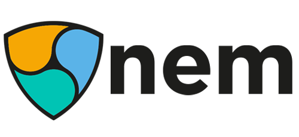

> A curated list of companies, projects and ICO's using the NEM blockchain (some are using Mijin, the private version of NEM, or in combination)

## Table of Contents
* [Authenticity](#authenticity)
* [Banking](#banking)
* [Companies](#companies)
* [Education](#education)
* [Exchanges/Trading](#exchangestrading)
* [Gaming](#gaming)
* [ICO](#ico)
* [IoT](#iot)
* [Loyalty/Rewarding](#loyaltyrewarding)
* [Payment](#payment)
* [Registration/Tracking](#registrationtracking)
* [Wrappers](#wrappers)
* [Not categorized yet](Not-categorized-yet)

## Authenticity
* [Apostille (integrated in NanoWallet)](https://blog.nem.io/apostille/) - Join [Telegram](https://t.me/nemred) - With the release of NanoWallet, NEM is introducing its first version of Apostille, a second-generation blockchain notarization service. The word “Apostille” was popularized during the Hague Convention of 1961 in an agreement signed by 112 countries to make Apostilles the official form of international notarizations. The NEM blockchain and Apostille program takes the same idea of notarizations but instead of having notaries backed by political will and treaties, has notarizations backed by an international and decentralized blockchain bound by computer code and cryptography.
* [LuxTag](http://luxtag.io) - We are providing the first ever digitized certificates of authenticity for products (or machines, or vehicles, etc.) on a blockchain that will be updatable, can have messages attached, and their conjoint ownership can be flexibly transferred.
* [OpenApostille](https://www.openapostille.net/) - OpenApostille is a service with which you can share your Apostille created by NEM Wallet (NanoWallet) with everyone. Your ideas, thoughs, illustrations, whatever you put into Apostile as a promise will be public and garner attentions by using OpenApostille. Let's make a certificate by NEM Apostile and share it by OpenApostille.
* [PROVER](https://prover.io/) - Join [Telegram](https://t.me/prover_nem) - PROVER is a blockchain service for confirming the authenticity of the events, facts, or phenomena. This is achieved through the confirming the authenticity of the video on which this event was recorded. If the video is real - the fact is true. If the video being faked - no. It can be taken into account to make legal and financial decisions based on it ([Proposal](https://forum.nem.io/t/prover-a-block-hain-service-for-confirming-the-authenticity-of-events-facts-or-phenomena/13210)).

## Banking
* [Bankera](http://www.bankera.com) - Join [Telegram](https://t.me/bankera) - Spectrocoin is building Bankera, a digital bank to last for the blockchain era.

## Companies
* [Asta | Blockchain](http://www.astablockchain.com/) - We work with our clients to develop use cases for real world Blockchain solutions.
* [Atraura Blockchain](https://www.atraurablockchain.com/) - The mission of Atraura Blockchain is to respond to the concerns of our clients related to Blockchain technology, providing talent, information and solutions that allow companies to exploit their value proposition in the clearest and most efficient way possible.
* [Dragonfly Fintech](http://www.dfintech.com/) - Dragonfly Fintech Pte Ltd is a Singapore-incorporated financial technology company. It is a pioneering leading edge blockchain platform solution provider for a financial ecosystem, including for the payment, clearing, and settlement sector. The founder is Lon Wong, a serial technopreneur, and inventor of a patent-pending fintech business method. Lon Wong is a core team member of the open source NEM blockchain technology project initiative.
* [RapidQube Digital Solutions](http://www.rapidqube.com/) - One such company in India specializing in AI, Big Data, Blockchain, and IOT, RapidQube Digital Solutions, has already been a working prototype built on the NEM Blockchain implementing an advanced medical health records application. Their app utilizes the NEM protocol to allow patients to share selective medical records with their medical care providers in time locked sessions on an as-needed basis. This gives patients full rights to their data and makes them more active participants in their treatment process.
* [RMIT University](https://youtu.be/iUElP1E40Ns?t=126) - Please watch YouTube video
* [Snap Interactive](http://www.snap-interactive.com/) - SNAP was attracted to NEM as a “best-of-class” scalable blockchain technology offering secure Proof-of-Importance consensus protocol, configurable assets, and smart signing contracts. NEM’s node reputation system and native multisig capabilities provide the high level security standards required to meet SNAP’s design philosophy for Backchannel. We believe that NEM’s technology is highly regarded in the blockchain industry, and significant developer adoption has fueled the XEM coin to obtain a market capitalization ranking in the top 10 of all crypto-currencies.
* [XPOS Consortium](https://xpos.co/) - XPOS Consortium will transform the traditional economy with a solution that unites loyalty points, alternative payment gateways, payment devices as means, crypto payment service providers, crypto remittance agents, licensed money services companies into one.

## Education
* [CoderSchool](http://www.coderschool.vn/) - We’d like to propose for Coderschool and the NEM Foundation to work together in 2018 to developers on NEM Blockchain technology ([Proposal](https://forum.nem.io/t/coderschool-funding-collaboration-with-nem/13399)).

## Exchanges/Trading
* [AbacasXchange](https://abacasexchange.com/) - The AbacasXchange: A NEM blockchain-powered, universal asset exchange to trade any asset, anywhere, anytime. The AbacasXchange is an unopinionated, universal asset exchange [DEX] & community platform with a robust business model targeting general asset purveyors, retail and institutional investors, market makers, digital rights owners, crowdfunders and traders. The platform could deploy on NEM as its independent ledger book of record and a key component to the Approved by Abacas Proof of Asset product. Abacas distinguishes itself by promoting ancillary chain offerings in the areas of asset provenance, AML/KYC and identity/document authentication ([Proposal](https://forum.nem.io/t/the-abacasxchange-a-nem-blockchain-powered-universal-asset-exchange/10113)).
* [ATUM](https://atumchain.com/) - Join [Telegram](https://t.me/atumpreico) - Atumchain is a decentralized cryptocurrency trading platform. The goal of Atum is to provide transparent client-client (wallet-wallet) trades without depositing funds in the exchange and to provide clearing of these settlements. Clients of Atumchain will execute trades directly with each other. The main aim is to build a bridge between blockchains where orders are kept and to realize them when the required conditions are met (bridge-momentum). Bridge-momentum is the moment when transaction is considered to have been executed and it is the time to make payment. The transaction is considered to have been executed at the moment when the first pair which meets the price terms is found and transaction volumes are balanced. Clients may cancel or change the transaction before bridge-momentum but when it occurs this chain is frozen until the moment of the settlement and volume rebalancing takes place.
* [Dimcoin](http://www.dimcoin.io) - Join [Telegram](https://t.me/dimcoinICO) - Trade shares on blockchain for the first time with DIMCOIN and the DIM Ecosystem.
* [Fundplatform](https://fundplatform.io/en) - Join [Telegram](https://t.me/FundPlatform) - Fund Platform is a platform for building trade and investment crypto funds at the decentralized, convenient and secure service.
* [NEM Exchange](http://www.the-blockchain.com/2017/07/27/nem-io-foundation-create-xem-exchange/) - Join [Telegram](https://t.me/nemred) - NEM.io Foundation to Create a XEM Exchange
* [Mosaic Exchange](http://nemchange.com) - Mosaic Exchange is a website, where you can sell and buy NEM based tokens(called mosaics), and(in the future) other cryptocurrencies.
* [Zaif](https://zaif.jp/?lang=en3) (Mijin) - Exchange
* [Zeus Exchange](http://zeus.exchange) - Join [Telegram](https://t.me/zeus_exchange) - Develop a hybrid decentralized trading platform for the financial industry of tomorrow. Build an IT solution that bridges crypto economy and capital markets. Empower global financial infrastructure with blockchain solutions

## Gaming
* [PacNEM](https://www.pacnem.com) - Check [Source](https://github.com/evias/pacNEM) - This game is a Free & Open Source Node.js Autonomous Game using the nem Blockchain. This project uses the nem Blockchain to authenticate Players as well as for Managing Game Sponsors and Mosaics Payouts which are done with Multi Signature Accounts. The game will also store Game Credits and High Scores on the blockchain. This game will reflect how easy it is to use nem in your applications or games business layers and will emphasize the easy Setup for sponsoring and advertising Software in the Gaming industry using the nem Blockchain as well as Instant Payments.
* [Xarcade](https://www.xarcade.io) - Join [Telegram](https://t.me/xarcadeofficial) - Xarcade is a NEM powered cost-effective video game distribution/exchange platform for both game publishers and gamers to use. It is a game changer and is a cost-less direct alternative to other app stores in the market. Xarcade does not levy game publishers anything for the sale of in-game credits, changing the paradigm, and passing these cost savings to gamers.

## ICO
* [COMSA](http://www.comsa.io) - Join [Telegram](https://t.me/comsaio) - COMSA is not just a cross-chain controller and router. It is also a conduit for future ICOs that want to exist in the COMSA ecosystem.

## IoT
* [Ethyl](https://forum.nem.io/t/ethyl-the-future-of-the-internet-of-things/12106) - Join [Telegram](https://t.me/ethylC) - Ethyl decentralizes the internet of things using the NEM blockchain. Every building or household installs a single hub that also acts as a decentralized server. As long as electricity is flowing in the home or building, the IoT devices will keep working without relying on internet access or centralized servers. (Except, of course, when chain functionality is required to communicate with or read data from other devices.) Ethyl supports offerings from a wide variety of vendors. It supports open standards such as Z-Wave, ZigBee, and general RF, as well as IP-based APIs for existing smart home devices. Note that even though Ethyl is primarily based on the blockchain, most communication happens off chain to eliminate fees during day to day use. In short: Ethyl safely and securely moves the internet of things onto the NEM Blockchain.

## Loyalty/Rewarding
* [FamilyPoints](https://familypoints.io/) - Join [Telegram](https://t.me/familypointstoken) - Our mission is to disrupt the parenting industry in order to make it safer, more convenient, and more transparent for everyone involved. The FamilyPoints platform will make parenting cheaper and education more accessible. We are creating the world’s first fully transparent blockchain ledger which stores information about reviews, rewards, and transactions to build a system of trust for children’s products and education.
* [Fluffr](https://fluffr.io) - Fluffr is working to create the use of Augmented Reality to engage with customers. Think about it for a moment. You go to an event, you pull out your phone, you interact with the environment, and you receive Fluff Tokens or Carat Tokens. That's right... Fluffr allows people to earn crypto currency by being part of the event in the virtual world. Unlike traditional crypto mining rigs like ASICs for BTCs or GPU/CPUs for Ethereum that allow you gain new crypto coins, Fluffr allows you to mine or "earn" tokens by using Fluffr's own "Proof of Engagement". And this POE is built on top of the NEM Blockchain foundation. This unique form of user engagement can be fun for consumers and beneficial for businesses.
* [LocationCore](https://www.digital2go.com/blockchain/) - Join [Telegram](https://t.me/locationcore) - We aim to be a transparent and honest data collection company using the NEM blockchain as a way to mitigate the trust relationships consumers often have with app providers. We would set up a namespace and mosaic on the NEM blockchain that would act as the base currency for the remuneration of user data, they would be awarded these mosaics as a reward for the time they have shared their location data with us. All transactions will be recorded in this base currency with users having the option to “cash out” to fiat or hold their tokens with the hope of it appreciating in price. As the uptake of the application continues the transaction volume will also increase. By forging partnerships with app developers and IoT product developers we aim to create an entire ecosystem whereby location data is rewarded at point of creation on the NEM blockchain increasing both the visibility and value of XEM as a currency and everyone’s ROI in the process. We chose NEM because it doesn’t require complicated cryptographic knowledge or dangerous smart contract development in a long-term unproven language, we can use the languages and tools we are most efficient with in order to deliver what we feel is a solid project ([Proposal](https://forum.nem.io/t/locationcore-democratising-personal-user-location-data-through-the-nem-blockchain/12577)).
* [LoyalCoin](https://loyalcoin.io) - Join [Telegram](https://t.me/LoyalCoin) - The LoyalPlatform: Where everyone can earn and use loyalty points everytime, everywhere

## Payment
* [Choice](http://www.choicetopay.com/) - Join [Telegram](https://t.me/choicetopay) - Desciption: Choice is a NEM-powered payment protocol platform aiming to replace existing payment gateways with direct transactions, change consumer and retailer behaviour, and create tangible social impact at a protocol level using the NEM blockchain. We have the support of Kiwibank’s innovation vehicle the Kiwibank Fintech Accelerator 2.0 (Kiwibank is a registered bank ultimately owned by the government) and are aiming to be the first Kiwibank-backed NEM project ([Proposal](https://forum.nem.io/t/choice-a-liberated-payments-protocol-nem-community-fund-proposal/13380)).
* [Eroiy](https://www.eroiy.io/) - Join [Telegram](https://t.me/joinchat/IFoU4EnxgQAtz3qVzAvVvw) - Desciption: Eroiy – The payment method of the adult industry. Anonymous & safe.
* [GCCH Coin](https://www.gcchcoin.com/index.html) - Join [Telegram](https://t.me/gcchcoins) - Blockchain technology to offer faster digital transactions and other services through smart contracts. The development of the GCCH coin is also in line with achieving goals of the Global Partnership for Financial Inclusion (GPFI), which is an inclusive platform for all G20 countries.  One of the G20’s focuses is centred on spurring broader and stronger economic growth, by deepening financial intermediation and increasing efficiency of and access to payment, savings, insurance, and credit services.  In this context, the GCCH coin was developed. The GCCH coin has the potential to enhance transparency and reduce long-standing inefficiencies and costs within multiple sectors of African economies. From enabling micropayment systems to smart contracts, the GCCH coin is expected to leapfrog traditional technology infrastructures in African nations and drive a new era of more inclusive growth.  ‘Studies show that broader access to and participation in the financial system can reduce income inequality, boost job creation, accelerate consumption, increase investments in human capital, and directly help poor people manage risk and absorb financial challenges’.
* [GiveMatters](http://givematters.io/) - Join [Telegram](http://t.me/GiveMatters) - GiveMatters aims to provide a Community Hub for registered Charities, Not-for-Profits and NGO’s to publicise their initiatives and projects. This will allow potential Donators to become more informed about what those organisations are looking to achieve and the successes they realise. We truly believe this technology is the future of donations. No Barriers, No bureaucracy, More value, More transparency, More accountability and importantly more aid to those who need it. The platform will enable potential donators to identify an initiative they wish to contribute to, and donate using cryptocurrency to anywhere in the world, instantaneously, eradicating the bureaucracy and ensuring a high level of transparency and accountability by providing full visibility into the how, when and where that donation was spent.
* [Graft Network](https://www.graft.network) - Join [Telegram](https://t.me/GraftNet) - *Remark: Only the ICO is using NEM*
  - Graft is a global, open-sourced, blockchain-based, decentralized payment gateway and processing platform that anyone can use. Any buyer and merchant can use Graft in a completely decentralized and inexpensive way. Graft ecosystem is open, so anyone can participate by maintaining Graft blockchain and implementing network services. Graft employs payment processing protocols and flows similar to traditional electronic payment systems such as credit, debit, and prepaid cards, which are already familiar to and trusted by millions of users and merchants around the world. This approach enables easier and faster adoption of Graft as a mainstream payment platform, while eliminating the need for centralized intermediaries (payment gateways and processors) currently required to facilitate transactions between buyers and merchants.
* [NEMp3](https://nemp3v2.herokuapp.com) - A music download store, enabling artists to sell their music directly using the NEM blockchain for payment verification. A React app built on the MERN stack, with Amazon S3 for music storage. Testnet and mainnet versions are available. A rebrand will likely take place following an exploration of possible income models.
* [PundiX](https://pundix.com) - Join [Telegram](https://t.me/Pundix) - Empowering blockchain developers and token holders to sell cryptocurrency and services at any physical store in the world. Making cryptocurrency accessible to everyone.
* [TravelbyBit](https://forum.nem.io/t/travelbybit-travel-the-world-and-pay-with-xem/13227) - Join [Telegram](https://t.me/TravelbyBit) - A foundational application of digital currencies is instant payment and transfers anywhere around the world. TravelbyBit is implementing this concept in the travel industry. Our goal is to facilitate peer to peer transactions based on the principles of decentralization and individual privacy by promoting the adoption and actual use of digital currency payments for goods and services, focusing on the retail and travel sector. Our payment system is already in use across Australia in a premium hotel chain and a growing list of businesses, from airport transfer services to tour operators. We also have a strategic partnership with Brisbane Airport Corporation where 75% of their retail stores are using our Crypto payments system. Once implemented in Brisbane, these same partners will be looking to integrate the system into their existing businesses in Sydney, Melbourne, Perth and Adelaide airports. We currently support payments operating on the following blockchains: Bitcoin, Litecoin, Ethereum and Dash. We have been observing the growth of XEM as a stable coin with inherently strong fundamental technology on the NEM blockchain.
* [WeChat Payment App](https://www.reddit.com/r/nem/comments/7jqpey/nem_xem_nem_wechat_wallet_release_21_dec/) - Release of the new NEM WeChat Wallet. WeChat is owned by Tencent - 6th largest company in the world by market cap.

## Registration/Tracking
* [Blockgrain](http://www.blockgrain.com.au) - Join [Telegram](https://t.me/blockgrain) - Designed by industry for industry, BlockGrain is Australia’s most comprehensive grain supply chain software solution. Whether you are a grain grower, broker, buyer or logistics provider, BlockGrain is the intuitive software platform for your smartphone, tablet or computer. Designed to help you gain greater control and visibility over your supply chain, BlockGrain removes manual paperwork and improves your bottom-line performance.
* [Copyrightbank](https://beta.copyrightbank.com) - Copyright Registration and Verification. Blockchain-powered for digital works.
* [ECObit](http://ecobit.io) - Join [Telegram](https://t.me/EcobitOfficialTelegram) - Another unique EcoBit initiative is to use blockchain technology to deploy traceability disciplines on all EcoBit chain of produce movement. This is a classic challenge for ages and EcoBit is using NEM blockchain technology to track the certificates, movement and records with NEM's digital ledgers to ensure full integrity from production to delivery of EcoBit produce. EcoBit owns these eco-friendly businesses and will demonstrate that this first in the world implementation for traceability is practical and reliable using blockchain technology which is now available. EcoBit will deploy this application as each of these projects come on-stream and those consuming the produce can be sure of the points of origination to the points of delivery.
* [Landstead](http://landstead.atraurablockchain.com) - Landstead uses NEM blockchain technology to create a registry of land and property, allowing government and citizens to co-create an open blockchain system that can be trusted and consulted by interested parties.
* [Meat tracking Japan](http://mijin.io/en/992.html) (Mijin) - As Japan tries to tackle the reality of wildlife overpopulation, a government ministry is tapping a blockchain to streamline the meat supply chain process that will enable end consumers to trace the history of the meat, from the hunting grounds.
* [MHub](https://mhub.my/) - Join [Telegram](https://t.me/NEMHub) - Transforming the property sector through blockchain-powered property registration and verification ([Proposal](https://forum.nem.io/t/mhub-transforming-the-property-sector-through-blockchain-powered-property-registration-and-verification/13341)).

## Wrappers
* [CSharp2Nem](https://github.com/NemProject/csharp2nem) - The CSharp2nem Api wrapper library is designed to simplify development on and use of the nem blockchain. CSharp2nem flexibly supports mainnet, testnet and mijin.

## Not categorized yet
* [Chronobank](https://chronobank.io) - Join [Telegram](https://t.me/chronobank) - ChronoBank.io is an ambitious and wide-ranging blockchain project, aimed at disrupting the HR/recruitment/finance industries in a similar way to how Uber disrupted the taxi business and how Upwork represented an evolution in freelancing.
* [Digitcoin.world](https://digitcoin.world) - Join [Telegram](https://t.me/digitcoinworld) - DIGIT Solutions is the most powerful Total Blockchain-Based Digital Marketing Solutions and specifically designs to deliver the digital marketing solutions for brands, merchants, retailing and service industries in different type of commerce (B2B, B2C, and C2C). All advanced application features of DIGIT Solutions are synchronized and enhanced the efficiency and effectiveness of brand’s digital marketing campaign. Using DIGIT Solutions, we can minimize the processing delay, get greater transparency, and dramatically reduce the costs with maximize profit. Blockchain-Based platform is a mechanism that guarantee the validity of the transactions with the highest degree of accountability. The DIGIT Solutions is created under the NEM Blockchain Platform, which is one of the largest blockchain/cryptocurrency projects in the world.
* [DM Coin](http://dmc.darcmatter.com/) - Join [Telegram](https://t.me/DarcMatter) - DarcMatter is developing a blockchain based distributed ledger to remove opacity and inefficiencies from the global alternative investment industry. DM Coin (DMC) will be used for a permissioned blockchain, and will use systems that run natively on the NEM blockchain. DMC will be utilized to unlock and to consummate the smart contracts for the investment completion through the DM Decentralized Infrastructure.
* [MiCai](https://forum.nem.io/t/micai-the-world-s-first-ai-based-private-wealth-management-protocol-built-on-the-nem-blockchain/10698) - At MiCai, we’re developing the world’s first crypto wealth management platform to increase market access and flow of crypto assets. The MiCai protocol is an open-source API built on the NEM blockchain, and incorporates the entire ecosystem for private wealth management. This means that NEM will become the core technology upon which HNWIs will rely on to diversify their wealth into crypto.
* [myCoinvest](https://www.mycoinvest.tech/) - Join [Telegram](https://t.me/joinchat/GPVrTA0Kj9JresZM3E93yA) - Since the introduction of Bitcoin, blockchain technology has grown in leaps and bounds. Blockchain has not only paved the way for cryptocurrencies to flourish, but has opened an unlimited amount of opportunities in other traditional sectors such as financial services. Now more than ever, people are dreaming of financial freedom and the ability for their money to work for them. However in reality, most people don't have the tools or time to make informed decisions involving investments. Our solution to this age old problem, is a user friendly financial savings ecosystem – an ecosystem that offers an incentivized automatic savings platform powered by blockchain. We also would like to introduce the VEZCOIN (CVZ) cryptocurrency as an integral part in making this possible. CVZ will be the primary mechanism of value transfer on our platform - which allows users to conveniently save for both long and short term financial objectives.
* [Qchain](https://qchain.co) - Join [Telegram](https://t.me/qchainplatform) - Our vision is to build a suite of open and transparent applications that provide decentralized and secure solutions for digital advertisers, in-house marketers, content publishers and everyday Internet users alike. Our flagship application is a direct buy marketplace that will make it easy and simple for advertisers and publishers to transact in native ad units.

## License

